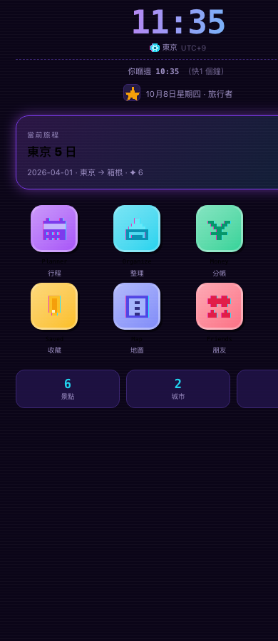

<div align="center">

# Wander

**旅行計劃 app —— 由貼一條 link 到排好每日行程**

貼一個 Google Maps / Instagram 連結，自動抽出地址同座標，
按地理位置分區、排每日行程、分帳、購物清單、多時區時鐘。

<br>

[功能](#-功能) · [技術](#-技術亮點) · [架構](#-架構) · [快速開始](#-快速開始)

<br>

<table>
<tr>
<td><br><sub>登入</sub></td>
<td><br><sub>主畫面 + 世界時鐘</sub></td>
<td><br><sub>收藏 + 地名 facet</sub></td>
</tr>
</table>

<sub>⚠️ 上面係由真元件 SSR render 出嚟再截圖（唔係設計稿）</sub>

</div>

---

## ⚡ 一句話

> 一個**冇用任何 AI** 嘅旅行計劃工具：所有解析、分區、時區判斷
> 都係**可預測嘅規則引擎**，1,900+ 個測試守住。

---

## 🎯 功能

| App | 做咩 |
|---|---|
| 🗓 **Planner** | 月曆總覽 + **拖放編排**（Pointer Events，手機都拖得）|
| 📥 **Organize** | 貼 link → 自動解析地名、地址、座標、圖片 |
| 💸 **Money** | 分帳（整數 cents 運算，冇浮點誤差）|
| 🛒 **Shopping** | 購物清單 + 相框 + **多貨幣** |
| 🔖 **Saved** | 收藏瀏覽 + 搜尋 + **由地址自動抽出地名 facet** |
| 🗺 **Map** | Leaflet + OSM，顯示每日路線 |
| 👥 **Friends** | 朋友 + QR code（雙向確認，唔可以加自己）|
| ⚙️ **Settings** | 個人檔案、頭像、主題、教學重播 |
| 🛠 **Dashboard** | 後台：幾多數據 + 邊個用戶用緊 |

### 特別做得好嘅位

- **世界時鐘** —— 上面大字係**你手機嘅時間**，下面細字係
  **你自己揀嘅城市**（打中文／英文都得，本機 134k 城市庫即時查）
- **多貨幣** —— 每項購物可以自己揀貨幣（JPY／KRW／EUR…），
  總額自動按**即時匯率**換算，換唔到會明確講（唔會靜靜畀錯錢）
- **地名 facet** —— 你 save 咗「博多」，因為地址有「福岡市」，
  就自動出一個 `[福岡市 2]` 嘅 chip 畀你 tick 篩選
- **托盤按城市分組** —— 排 Day 3（福岡）嗰陣，福岡嘅景點排最前
- **37 個 16×16 像素頭像** —— 程序化生成，唔係用圖檔
- **離線優先 PWA** —— cache-first shell、network-first 導航、
  LRU 圖磚快取（上限 800 塊）

---

## 🔬 技術亮點

### ① 純規則引擎，零 AI

```
engine/wander/
├── links.py        Google Maps / IG / 小紅書 link 解析
├── caption.py      標題解析（中文地址、店名、地區詞）
├── localgeo.py     134,655 個地名 + 146 個手動整理區
├── tz.py           時區判斷（國家 → 經度分帶 → Etc/GMT±N）
├── currency.py     匯率（兩個免費 API + 6 個鐘快取）
├── zones.py        Haversine 貪婪分群（確定性，唔隨機）
├── qr.py           自己寫嘅 QR 編碼器（版本 1–20）
└── lookup.py       Photon → Nominatim → Overpass 三層 fallback
```

**為咩唔用 LLM**：旅行計劃要**可預測**。同樣嘅輸入要出同樣嘅結果，
而且要**解釋得到**為咩分喺嗰區。規則引擎做得到，LLM 唔得。

### ② 貼一條 Google Maps link 就抽到嘢

```
/maps/place/店名,@lat,lng,17z/data=!3d..!4d..   ← 最完整
/maps/place/35.6586,139.7454/@..                 ← 純座標
/maps/search/?api=1&query=店名
/maps/dir/?api=1&destination=成田機場
/maps/@lat,lng,17z                               ← 只有視窗中心
maps.app.goo.gl/xxxx                             ← 短連結（跟 redirect）
```

⚠️ 店名連住地址會**拆開**（`一蘭拉麵 本店, 1 Chome-1-1 …`）；
⚠️ 純座標唔會當做店名；⚠️ `place_id:` 會丟棄；
⚠️ 有座標但冇地名 → **本機 134k 城市庫反查**國家／城市。

### ③ 自己寫 QR 編碼器

冇用 `qrcode` 套件 —— 純 Python 實作：
Reed-Solomon 糾錯、遮罩模式選擇、版本自動升級。

### ④ 程序化像素藝術

```python
# engine/make_avatars.py
# 8×8 字串格 + 調色板 → SVG `shape-rendering="crispEdges"`
AVATAR = P(['#outline', '#main', '#light'], [
    '..1111..',
    '..1221..',
    ...
])
```

### ⑤ 免費服務，零成本

| 用途 | 服務 |
|---|---|
| 地理編碼 | Photon (Komoot) · Nominatim (OSM) |
| 圖磚 | OpenStreetMap |
| 地名資料 | GeoNames（本機 DB，134,655 條）|
| 匯率 | jsdelivr (fawazahmed0) · open.er-api.com |
| 連結解析 | DuckDuckGo HTML · Open Graph |

---

## 🧪 測試

```
後端   pytest        1,103 通過
前端   node:test       780 通過（14 個套件）
引擎   selftest         10 通過
──────────────────────────────────
                      ~1,893
```

**測試捉到嘅真 bug**（唔止係「有測試」）：

| Bug | 測試點捉到 |
|---|---|
| `PixelIcon is not defined` → Planner 白畫面 | 靜態「用咗但冇 import」檢查 |
| `WorldClocks is not defined` → 主畫面爆 | SSR 真 render（`vite build` **捉唔到**）|
| `useMemo` 冇 import | 同上 |
| 密碼欄每次打一個字就失焦 | 「組件唔可以喺 render 內定義」檢查 |
| `--fg` CSS 變數唔存在（應為 `--text`）| CSS 變數完整性檢查 |
| `$VAR` 後面跟全形括號 → bash `unbound variable` | shell script 掃描 |
| `history.back()` 做 tab 嘅「返去」→ 跳出 app | 導航審計 |
| 後台入口 `isAdmin` 永遠 false（只喺 mount 檢查）| 真 render 比對 admin／非 admin |
| `nowIn()` 回 `hh`/`mm` 但用咗 `hours`/`minutes` | 時間顯示測試 |

> ⚠️ 而且**測試會 match 到自己嘅註解** —— 所以所有原始碼檢查
> 都會先剝走註解。呢個陷阱中過好多次。
>
> ⚠️ 但要小心：**唔可以一刀切剝三引號字串** ——
> 呢個 codebase 嘅 SQL 就係寫喺三引號入面。

---

## 🏗 架構

```
                        ┌──────────────┐
   瀏覽器 (PWA)  ──────▶ │  FastAPI     │
   React 18 + Vite      │  port 8787   │
                        └──────┬───────┘
                               │
              ┌────────────────┼────────────────┐
              ▼                ▼                ▼
        ┌──────────┐    ┌──────────┐    ┌──────────┐
        │ SQLite   │    │ 規則引擎  │    │ 免費 API  │
        │ 單一檔案  │    │ 純 Python │    │ Photon…  │
        └──────────┘    └──────────┘    └──────────┘
```

**單一 port** —— 後端直接 serve 前端 build 出嚟嘅檔案。
冇 CORS、冇 nginx、冇 docker-compose。

```
engine/     11,000 行   解析引擎
web/src/    11,000 行   React 前端
tests/      11,000 行   測試
server/app/  4,000 行   API
────────────────────────────
            37,000 行
```

### 安全

- 密碼：PBKDF2-HMAC-SHA256，**600,000 次迭代**、per-user salt、
  `hmac.compare_digest` 比較
- Session token：`secrets.token_urlsafe`
- 刪帳號：**轉移**擁有權（唔會連累朋友嘅旅程）
- GZip 壓縮 + 上傳大小限制 + SPA fallback 唔會蓋過 API

---

## 🚀 快速開始

```bash
git clone https://github.com/Mizuki0215/Wander.git
cd Wander

# 前端 build
cd web && npm install && npm run build && cd ..

# 後端
pip install -r server/requirements.txt
cd server && python -m app
```

開 http://localhost:8787

**或者一鍵**：
```bash
./run.sh
```

### 用手機（HTTPS → PWA）

```bash
./host.sh          # cloudflared quick tunnel
```
→ Safari：分享 → 加到主畫面

⚠️ HTTPS 之下 service worker、相機、剪貼板全部用得
（`http://192.168.x.x` 做唔到）。

### 部署

| 方法 | 成本 | 指令 |
|---|---|---|
| **☁️ Google Cloud（推薦）** | **$0/月永久** | 見 [GCP.md](GCP.md) |
| 對外開放（臨時）| $0 | `./host.sh` |
| Fly.io | US$3.44/月 | `./deploy.sh` |
| 固定網址 tunnel | $0（要開電腦）| `./keep-tunnel.sh` |

#### ⚠️ 為咩 GCP e2-micro 係最好

```
💰 $0/月（永久，唔係 trial）
✅ 1 GB RAM + 2 vCPU + 30 GB 持久磁碟
✅ 24/7，唔會 sleep
✅ SQLite + 上載嘅相都留住
⚠️ 要信用卡（但唔會收錢）
```

⚠️ **一鍵部署**（喺 Google Cloud Shell 貼）：
```bash
curl -fsSL https://raw.githubusercontent.com/Mizuki0215/WANDER/main/deploy-gcp.sh | bash
```

⚠️ **為咩唔用其他**：
- **serveo / cloudflared** —— 要你部電腦開住（旅行時唔得）
- **Fly.io** —— 2024-10-07 已取消免費 tier
- **Render** —— 免費版**冇持久磁碟** → SQLite 每次重啟清空
- **GitHub Pages** —— 只做靜態檔（冇 Python）
- **Codespaces** —— 60 鐘/月（差 12 倍）

---

## 📁 文件

| 檔案 | 內容 |
|---|---|
| **[GCP.md](GCP.md)** | **☁️ 部署去 Google Cloud（$0 永久）** |
| [DEPLOY.md](DEPLOY.md) | 其他部署（Fly.io / Codespaces / Docker）|
| [HOSTING.md](HOSTING.md) | 所有 host 選擇 + 自訂 link 名 |
| [DEVLOG.md](DEVLOG.md) | 開發日誌 —— 每個 bug 嘅根因同修法 |
| [docs/smtp/](docs/smtp/) | 寄信設定（Gmail App Password 陷阱）|
| [docs/mascot/](docs/mascot/) | 角色圖規格 |

---

<div align="center">

**技術**：Python · FastAPI · SQLite · React 18 · Vite · Leaflet ·
純規則引擎（無 AI）

</div>
